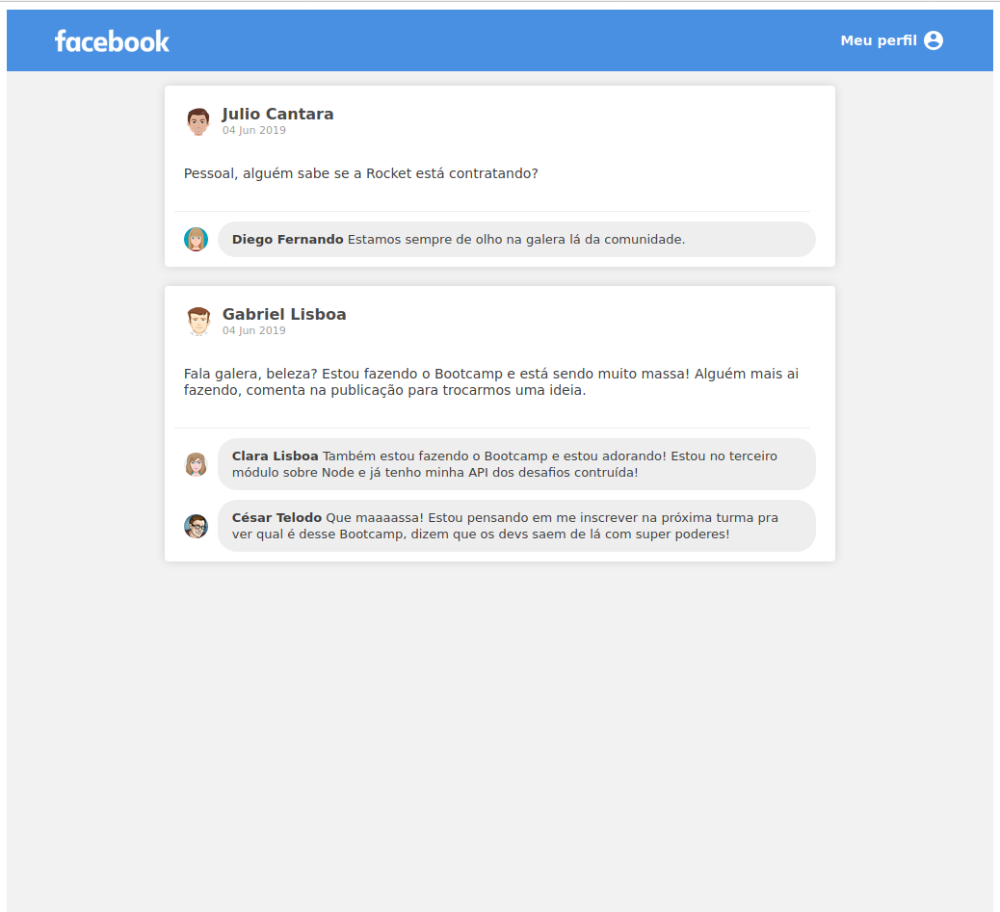

<h2 align="center">fb-layout-react</h2>
<h4 align="center">Just a simple clone of Facebook's layout for posts and comments screen built with ReactJS </h4>
 

 ### :computer: Languages and technologies:
 <li>Built using ReactJS and CSS</li> 
 Also used:<ul style="list-style-type:disc;">
  <li>Webpack</li>
  <li>Babel</li>
  <li>Webpack Dev Server</li>
  <li>Material UI Icons</li>
</ul>

Application screen:

 
(Responsive screen: components will adjust to screen size changes)

  ### :memo: License
  This project is under MIT license. Check [LICENSE](LICENSE.md) for details.